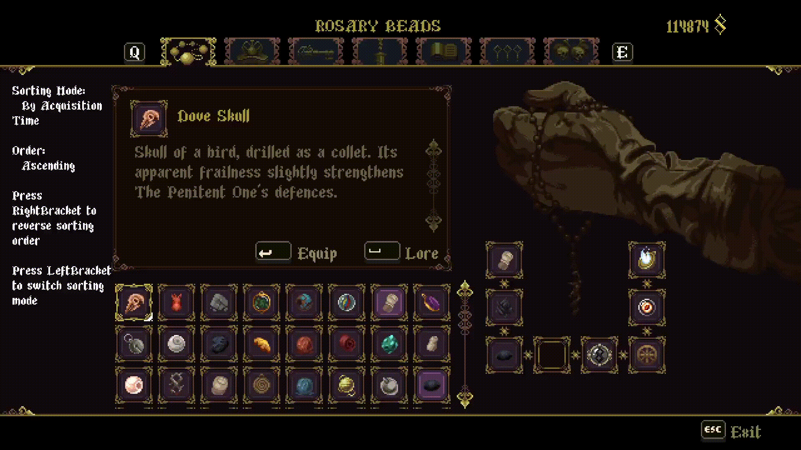

# Blasphemous: Inventory Sorting

A mod for Blasphemous 1 that allows sorting inventory objects in various customizable ways.

---

## Features

- Allow sorting inventory objects in various ways, including:
  - Customizable item re-order and dragging!
  - By Name, ID, or acquisition order (ascending or descending)

## Installation

This mod is available for download through the [Blasphemous Mod Installer](https://github.com/BrandenEK/Blasphemous.Modding.Installer)

Required dependencies (dependencies are auto-downloaded if installed through Mod Installer):
- [Modding API](https://github.com/BrandenEK/Blasphemous.ModdingAPI)
- [UI Framework](https://github.com/brandenEK/Blasphemous.Framework.UI)